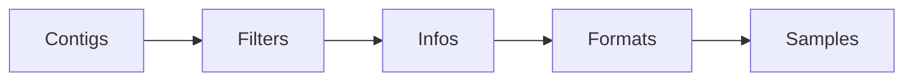

If you've ever needed to produce a typed binary format
where the header constrains what the body can contain,
you've probably written validation code that runs at runtime
and hoped your tests cover the edge cases.
With Rust, you can turn this into compile errors (my favorite!)
using typestates and phantom types.
These patterns generalize well beyond any single format.
I've previously [mentioned this][elegant-apis-in-rust] 10 years ago in a post,
and I still think its such a cool pattern
that it deserves another (proper) post.

[elegant-apis-in-rust]: https://deterministic.space/elegant-apis-in-rust.html#session-types

The format I'm working with is BCF,
the binary encoding of VCF used in genomics.
It's the main output of [Rastair], our variant caller.
I [wrote previously about seqair][seqair-post],
our reimplementation of core `htslib` functionality in Rust.
Writing BCF records through [`rust-htslib`] was
what originally motivated that work,
the bindings worked but were (out of the box) inefficient[^forked],
and I wanted to see if I could make it both correct and fast.

[^forked]: In Rastair, I used a fork that replaces some `CString` usage and it got much faster.

[Rastair]: https://www.rastair.com/ "Rastair website"
[`rust-htslib`]: https://github.com/rust-bio/rust-htslib "HTSlib bindings and a high level Rust API for reading and writing BAM files."
[seqair-post]: https://deterministic.space/seqair.html "Seqair, a custom htslib reimplementation"

This post walks through the API choices I made,
what alternatives exist,
and what I learned about designing APIs like this.

## The header builder

A VCF file starts with a header
that declares every field the records are allowed to use:
contigs (chromosomes), filters, INFO fields, FORMAT fields, and sample names.
BCF, the binary version, adds a constraint:
it encodes field names as integer indices into a "string dictionary,"
and that dictionary must be emitted in a fixed order[^bcf-dict].
The header builder walks through phases
that mirror this dictionary order.

[^bcf-dict]:
    `PASS` filter at index 0, then other filters, then `INFO` definitions, then `FORMAT` definitions.
    This is not always obvious from reading the spec but it's what `htslib` expects.



Each phase is a zero-sized type parameter on `VcfHeaderBuilder<Phase>`.
Transition methods consume `self` and return the builder in the next phase.
You can skip phases you don't need
(go from `Contigs` straight to `Infos` if you have no filters),
but you can never go backwards.

```rust {.wide}
pub struct VcfHeaderBuilder<Phase = Contigs> {
  // ...
  _phase: PhantomData<Phase>,
}
```

During each phase, only the matching `register_*` method is in scope.
Each registration inserts the field name
into the string dictionary at the next index
and returns a _typed key_:

```rust {.wide}
// In the Infos phase:
let dp: InfoKey<Scalar<i32>> = header.register_info(&DP_DEF)?;
let af: InfoKey<Arr<f32>>   = header.register_info(&AF_DEF)?;

// In the Formats phase:
let gt: FormatKey<Gt>        = header.register_format(&GT_DEF)?;
```

The type parameter (`Scalar<i32>`, `Arr<f32>`, `Gt`)
flows from the field definition to the key,
and it's what makes the rest of the system type-safe.
This is the format's actual invariants expressed in the type system.
But the key also carries the BCF dictionary index (a `u32`)
and the VCF field name[^smolstr],
resolved once and reused for every record.

[^smolstr]:
    I like using [`SmolStr`] for immutable small strings like these.
    It inlines short strings (avoiding a heap allocation)
    and clones cheaply via reference counting in case we get longer ones.

[`SmolStr`]: https://docs.rs/smol_str/0.3.6/smol_str/

## Typed keys and phantom types

The type parameter on `InfoKey<V>` and `FormatKey<V>`
is an uninhabited marker type:

```rust {.wide}
pub enum Scalar<T> { _Uninhabited(Infallible, PhantomData<T>) }
pub enum Arr<T>    { _Uninhabited(Infallible, PhantomData<T>) }
pub enum Flag      { _Uninhabited(Infallible) }
pub enum Gt        { _Uninhabited(Infallible) }
```

These types are "uninhabited":
no value of type `Scalar<i32>` can ever exist at runtime.
The single variant contains [`Infallible`],
which itself has no values,
so the variant can never be constructed.
The types exist only to carry type information
that the compiler uses to select the right `encode` method.

Why uninhabited enums rather than plain structs?
A simpler option would be `pub struct Scalar<T>(PhantomData<T>)`,
which is inhabited but zero-sized.
Nobody would construct one accidentally,
and if they did, nothing bad would happen.
The reason for the enum-with-`Infallible` dance
is that a variant-less enum with a type parameter
triggers E0392 ("type parameter `T` is never used"),
so you need at least one variant that mentions `T`,
and putting `Infallible` in it
makes the type genuinely unconstructible[^inhabited].
In practice the difference is cosmetic.
The struct version would work just as well.
I went with the uninhabited version
because it more precisely states the intent:
these types are not values, they are labels.

[^inhabited]:
    You could also use a trait-based approach,
    where `ScalarInt` is a unit struct implementing `trait InfoValueType { type Value; }`.
    That avoids the weird-looking enum entirely
    but adds more boilerplate for each new marker.

Anyway.
Here is how the markers select the right method:

```rust {.wide}
impl InfoKey<Scalar<i32>> {
    pub fn encode(&self, enc: &mut (impl InfoEncoder + ?Sized), value: i32) {
        enc.info_int(&self.0, value);
    }
}

impl InfoKey<Scalar<f32>> {
    pub fn encode(&self, enc: &mut (impl InfoEncoder + ?Sized), value: f32) {
        enc.info_float(&self.0, value);
    }
}

impl InfoKey<Flag> {
    pub fn encode(&self, enc: &mut (impl InfoEncoder + ?Sized)) {
        enc.info_flag(&self.0);
    }
}
```

There is no way to hand a `&[f32]` to a `Scalar<i32>` key,
or use a `FormatKey<Gt>` in an INFO context.
This is great!
(These are inherent methods, not a trait,
I'll explain why [below](#why-keyencode-and-not-encoderencode).)

The `InfoEncoder` and `FormatEncoder` traits underneath
are object-safe and format-agnostic.
A single `RecordEncoder` type contains an internal enum
that dispatches to either a BCF or VCF text arm.
The typed key narrows the broad trait interface down to exactly one method
with exactly the right value type,
and the format switch happens behind that.
The traits being object-safe matters separately:
the `EncodeInfo` trait (shown later) takes `&mut dyn InfoEncoder`,
so domain types can encode themselves
without being generic over the encoder.

## The record encoder typestate

Writing a record walks another state machine.
As a diagram, it looks like this:


The states are zero-sized marker structs,
and the encoder is generic over them:

```rust {.wide}
pub struct Begun;
pub struct Filtered;
pub struct WithSamples;

pub struct RecordEncoder<'a, S> {
    inner: EncoderInner<'a>,
    _state: PhantomData<S>,
}
```

Each transition consumes `self` and returns the encoder in the next state:

```rust {.wide}
impl<'a> RecordEncoder<'a, Begun> {
    pub fn filter_pass(mut self) -> RecordEncoder<'a, Filtered> { /* … */ }
    pub fn filter_fail(mut self, filters: &[&FilterId]) -> RecordEncoder<'a, Filtered> { /* … */ }
    pub fn no_filter(mut self) -> RecordEncoder<'a, Filtered> { /* … */ }
}

impl<'a> RecordEncoder<'a, Filtered> {
    pub fn begin_samples(mut self) -> RecordEncoder<'a, WithSamples> { /* … */ }
    pub fn emit(self) -> Result<(), VcfError> { /* … */ }
}
```

You cannot write two filter decisions,
skip the filter call entirely,
or emit `FORMAT` fields before declaring a sample count.

The types are `#[must_use]`,
so the compiler warns you
if you build a record and forget to call `emit()`.
None of this catches actual logic bugs in practice.
It's a safety net that makes the API hard to misuse,
especially when someone else (or an LLM[^llm-help]) is writing the calling code.

[^llm-help]:
    As I wrote about in the [previous post][seqair-post],
    a lot of seqair was written with Claude Code.
    Having the compiler enforce the protocol
    meant I didn't have to review every call site for ordering mistakes.

Underneath, the BCF arm writes typed values into shared and individual buffers,
picks the smallest integer width that fits each value,
and patches the record length prefix on `emit()`.
The VCF arm writes tab-separated text with the percent-encoding
and float-formatting rules the spec requires.
Both arms reuse their internal buffers across records,
so after the first record the encoder does zero allocations[^erased].

[^erased]:
    The writer is generic over `W: Write`,
    but the `RecordEncoder` itself uses `&mut dyn Write` internally
    so that the encoder type stays `RecordEncoder<'a, State>`
    with no extra type parameters leaking out.

## Why `key.encode()` and not `encoder.encode()`

The calling code for writing a record looks like this:

```rust
let mut enc = writer
    .begin_record(&contig, pos, &alleles, qual)?
    .filter_pass();

dp.encode(&mut enc, depth);
af.encode(&mut enc, &allele_freqs);
db.encode(&mut enc);

let mut enc = enc.begin_samples();
gt.encode(&mut enc, &genotypes)?;
sample_dp.encode(&mut enc, &per_sample_depth)?;
enc.emit()?;
```

The field name leads each line, a deliberate choice.
The more conventional alternative
would put the method on the encoder:

```rust
enc.encode(&dp, depth);
enc.encode(&af, &allele_freqs);
enc.encode(&db);
```

You could even make this generic with a trait:

```rust
trait Encode<K> {
    fn encode(&mut self, key: &K, value: K::Value);
}
```

That's a nice design and arguably more idiomatic.
But I preferred `key.encode()` for mainly one reason:
When scanning a block of field-encoding calls,
the field names are the varying part.
In the `key.encode(...)` style the field name starts the line
and the block is easy to scan.
Reading `enc.encode(field, ...)` is more noisy/difficult to me.

## Domain types encoding themselves

The typed keys are nice for ad-hoc encoding,
but in a real application like [Rastair]
the values usually come from domain types
that know how to serialize themselves.
The `EncodeInfo` trait captures this:

```rust {.wide}
pub trait EncodeInfo {
    type Key;
    fn encode_info(&self, enc: &mut dyn InfoEncoder, key: &Self::Key);
}
```

A simple wrapper type might look like this:

```rust {.wide}
struct Depth(i32);

impl Depth {
    const DEF: InfoFieldDef<Scalar<i32>> = InfoFieldDef::new(
      "DP", Number::Count(1), ValueType::Integer, "Combined depth"
    );
}

impl EncodeInfo for Depth {
    type Key = InfoKey<Scalar<i32>>;
    fn encode_info(&self, enc: &mut dyn InfoEncoder, key: &Self::Key) {
        key.encode(enc, self.0);
    }
}
```

The field definition is `const`,
so it can live right next to the type.
At header construction you write `header.register_info(&Depth::DEF)?`
and the schema stays co-located with the code that produces the values.

The associated `Key` type also supports tuples,
which handles the case
where one domain type maps to multiple VCF fields:

```rust {.wide}
struct StrandBias { ot: Vec<i32>, ob: Vec<i32> }

impl EncodeInfo for StrandBias {
    type Key = (InfoInts, InfoInts);
    fn encode_info(&self, enc: &mut dyn InfoEncoder, keys: &Self::Key) {
        keys.0.encode(enc, &self.ot);
        keys.1.encode(enc, &self.ob);
    }
}
```

The key is passed in rather than owned by the type.
This keeps things flexible
(the same type could encode under different field names in different contexts)
at the cost of threading keys through call sites.
In practice, Rastair collects all keys into a setup struct
that gets passed around,
so this hasn't been a burden.

## Where the type system ends

The phantom types and typestates catch a lot of mistakes at compile time.
But they cannot catch everything!
Here's an example of something not caught.

BCF encodes integer arrays
using the smallest type that fits the values:
`INT8` if everything is in `[-120, 127]`[^bcf-reserved],
`INT16` for larger ranges, `INT32` otherwise.
Each width has its own sentinel value for "missing":
`0x80` for `INT8`, `0x8000` for `INT16`, `0x80000000` for `INT32`.

[^bcf-reserved]:
    Why -120 and not -128?
    The BCF 2.2 spec reserves the 8 most-negative values of each integer type
    for sentinels.
    Two are currently defined — "missing" and "end of vector" —
    and six are reserved for future use.
    So for `INT8`, -128 through -121 are off-limits,
    leaving `[-120, 127]` as the usable range.

An early version of seqair had a bug
where the type selection scanned all values including placeholders,
and the missing-value sentinel was always `i32::MIN`.
An array like `[1, 2, MISSING]` would
correctly pick INT8 as the encoding (`1` and `2` fit),
but then always emit `i32::MIN` as the sentinel,
which doesn't fit in a byte.
The type system can't (currently) catch this.
Both the declared type and the value type are `i32`.
The bug is purely semantic:
the sentinel must match the _encoding_ width, not the _declared_ width.

A cross-format property test caught it.
The test generates random records,
writes them as both VCF text and BCF binary,
reads both back with [noodles],
and asserts the logical fields match.
The sentinel bug caused noodles to misparse the BCF
while the VCF text was fine.

Layered testing[^layers] can fill the gap
between what the type system enforces
and what the format actually requires.
Writing your understanding as tests means writing from yet another perspective,
which is valuable in itself.
It's also a great use case for LLM-assisted coding,
where verification is super important.
Specifying what correct behavior looks like is often easier than implementing it,
and the tests immediately tell you whether the generated code is right
leading to a quick feedback loop.

[^layers]:
    We have: property tests, cross-validation against reference implementations, round-trip checks, and fuzz targets.
    And what this doesn't catch will hopefully be caught when we run this in Rastair
    against many different inputs.

[noodles]: https://docs.rs/noodles "Bioinformatics I/O libraries in Rust"
[fuzz]: https://github.com/Softleif/seqair/tree/main/crates/seqair/fuzz "seqair fuzz targets"

## Building the index while writing

The same single-pass state machine idea
shows up again in index building.
When you write a `.bam`, `.bcf`, or `.vcf.gz` file,
you typically also want to produce its index (BAI, CSI, or TBI respectively).
The naive approach is a second pass over the finished file.
Seqair builds the index incrementally instead:
after each record is emitted,
the writer hands an index builder
a `(tid, start, end, virtual_offset)` tuple[^voff].
The builder places the record
in the smallest "bin" that fully contains `[start, end)`
and starts a new chunk when the bin or reference changes.

[^voff]:
    A BGZF virtual offset lets an index point at any record
    without decompressing the entire file.
    See the [previous post][seqair-post] for more on BGZF.

BAI, CSI, and TBI differ mostly in serialization details.
One state machine, three output writers,
and the same code path produces all three index formats.
I wrote the spec for this, had Claude Code implement it,
and then realized it's the same algorithm htslib uses internally.
That was reassuring!

## Benchmarks

I also wrote some benchmarks to make sure that seqair is not way slower
than our comparison points `htslib` and `noodles`.
Since this was my initial complained about `rust-htslib`,
I had to make sure to pick this up again.
Like the experiment with a columnar storage layout for BAM records
(see [previous post][seqair-post]),
just because I had the _idea_ that this streaming VCF encoder works,
doesn't mean it performs well in a real-world setting.

Luckily, I'm happy to say that we're quite performant,
both in Rastair and in our microbenchmarks!
All these numbers are in "elements per second", so higher is better:

[`criterion`]: https://docs.rs/criterion/0.8.2/criterion/ "A statistics-driven micro-benchmarking library written in Rust."

| format | complexity | rows | htslib | noodles | seqair |
| ------ | ---------- | ---: | -----: | ------: | -----: |
| BCF    | minimal    |   1k |  1.25M |    559k |  2.83M |
| BCF    | minimal    |  10k |  1.30M |    564k |  2.82M |
| BCF    | full       |   1k |   626k |    321k |  1.47M |
| BCF    | full       |  10k |   646k |    321k |  1.50M |

Using [`criterion`], I set up a couple benchmarks[^bench] for different use cases.
To me, writing semi-complex BCF files was the most interesting one
(that's what Rastair does),
and that's what the table above shows.
There are also benchmarks for writing `.vcf` and `.vcf.gz`.

A couple notes for the "all benchmarks are lies" crowd:
This was run on a MacBook, all implementations write to `/dev/null`,
and, yes, `htslib` and `noodles` allocate per-row
because that's the entire point of implementing seqair.

[^bench]:
    This is also a good anecdote for why I like writing blog posts.
    I had Claude Code write the original VCF benchmark code, and it looked fine.
    Then I added some more features and asked to extend the benchmark again.
    But what I totally missed: The `htslib` benchmark wrote to a temp file,
    while seqair and `noodles` wrote to a buffer!
    Only when I was writing this post did I review the code again and found this bug.

## What I'd do differently

The short version of the patterns above:
typestates work when they mirror a real protocol,
phantom types are cheap gatekeepers,
and layered testing can catch what the type system can't.

But I also spent time on things that didn't survive.
The first version of the writer used owned record types
where you'd build a `VcfRecord` struct, populate its fields,
and hand it to the writer.
It worked, but the allocation profile was (obviously) worse,
the API surface was larger,
and adding the streaming encoder made it redundant.
I had both implementations for a while before deleting the owned path.
In hindsight I should have committed to streaming earlier
and prototyped with real workloads
before investing in the owned-record API.

The phantom type boilerplate is another… choice.
Every new field type needs a marker enum, an impl block on the key,
and a method on the encoder trait.
It scales linearly and it's tedious.
A macro could generate most of it,
but I've resisted that so far
because the explicit code is easier to read and grep for.
I'm not sure that tradeoff is right.
But it's also only the library code, so it's my problem.

One thing I keep coming back to
is whether `key.encode(&mut enc, value)` is actually better
than the more conventional `enc.encode(&key, value)`.
A new contributor's first instinct might be to look at the encoder type for methods, not the key.
I find it more scannable but it's harder to discover.
