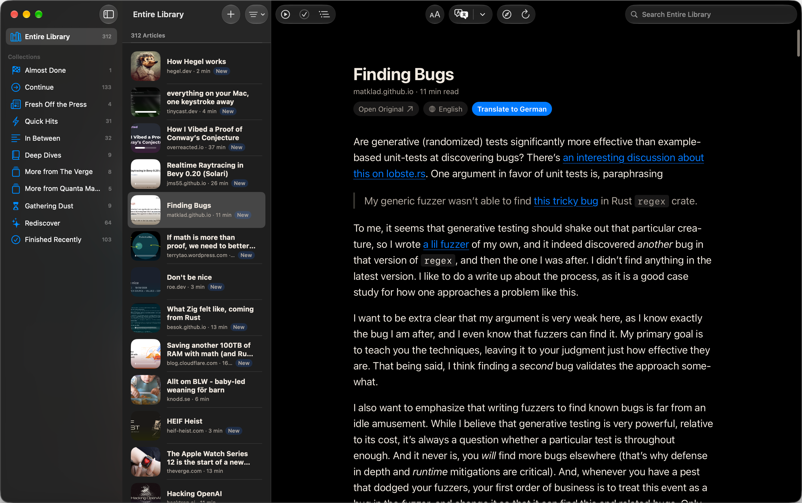
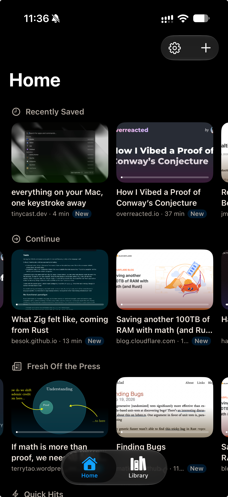
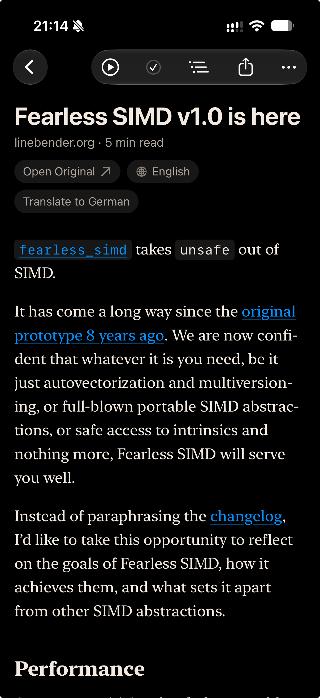
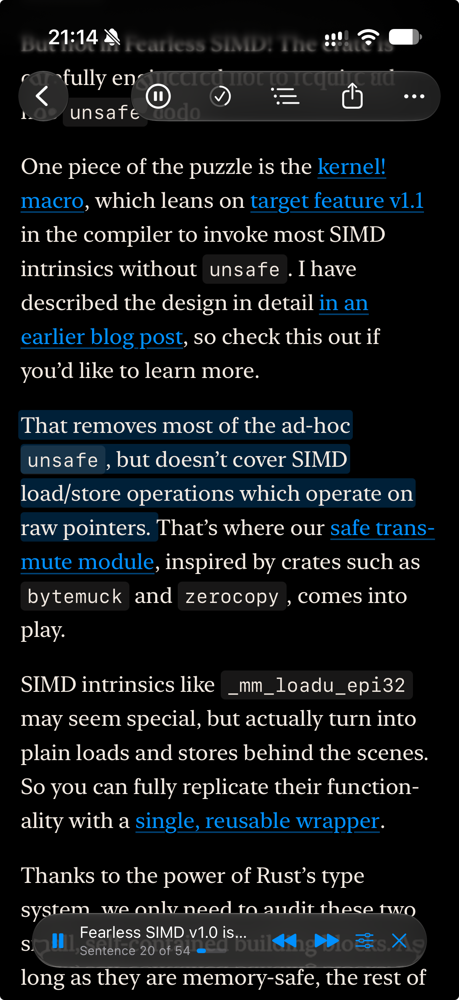

This post introduces Readleif,
a read-later and listen-later app for iOS and macOS that I built this summer.
The main ideas:
No account, no subscription, no server,
a library to browse rather than an inbox to clear,
and when listening, content blocks that don't read well aloud get a summary on the fly.

I've started on a first version, but it's at best beta quality right now.
And for now, the target audience is me:
It scratches an itch I've had for a while,
and I wanted to fiddle with something new,
in an ecosystem I've not worked in.

## Why a new app

I often see links to articles I want to read when I don't have the time to read them.
Until last year, I used Pocket[^pocket],
and when it died I exported all my saved links and extracted their content into Markdown files using a small script.
These files moved to an [Obsidian] vault and I keep adding to them.
It works but it's not that satisfying to browse through, so most articles just get ignored.

[Obsidian]: https://obsidian.md/ "Personal knowledge base app using Markdown files"

[^pocket]: Not my favorite, but it did the job until it was shut down in July 2025.
  I used to use Instapaper, but that was so long ago I don't remember why I stopped.

There are many apps out there, of course, that fit into this category.
But from a brief look they are either subscription-based
while locking you into their platform
(e.g. Readwise Reader, Instapaper, Matter),
or not that much better than my current Obsidian setup (e.g. GoodLinks, Wallabag).

My app uses no account, no subscription, and needs no hosted server,
making it (ideally) zero-maintenance.
I want to use it on both my laptop and my phone,
and for that to work I'm gonna cheat and make it Apple-only
and get iCloud to do the syncing.
Maybe it is even trivial to get Markdown files out of this directly,
so switching to another app is not a big deal.

I also want to go in some specific directions with how to interact with the content
since Obsidian (as I use it right now) doesn't really deliver what I want.

## A library, not an inbox

I use a feed reader[^feedbin] daily to catch up with a bunch of websites and blogs,
and I learned one thing:
I don't like the "inbox" concept/design.
It feels like a todo list, and not like a place to relax and read.
It works for mail and feeds which are sorted by date,
and that's also what I have in Obsidian
because all files are prefixed by their creation dates.

[^feedbin]: [Feedbin](https://feedbin.com/), ever since Google Reader died, which at this point was quite a while ago.

But for Readleif I knew I wanted to do something differently.
There's gonna be a "library" view that is the list of everything
and also has filters and search.

{class="wide"}

But the main entry point is a home view, which shows a couple of sections.
These are automatically generated but should feel "curated".
At the top there's "recently added", sure,
followed by sections like "5 random articles longer than 10min"
or "more from Wikipedia"
(shows up after I read a saved Wikipedia article).
I need to come up with some more of these,
and see which ones actually work nicely for me.

I also want to make sure that the app's UI is not (entirely) just lists and text.
Since I don't really control the content going in,
all I can do is come up with some designs and hope they are adaptable enough.
One idea my wife suggested is to create cards for articles
that are color-coded and also include the primary image and/or favicon.
This seems to work quite nicely.

{class="narrow"}

## Getting links in

I often see links on Hacker News or Bluesky that I'd like to read.
On my iPhone, I'd like to share these links and have Readleif be in the OS share panel.
When I tap on it, it should add that link to the app as fast as possible.
On macOS, I'm not sure what the best way to add content is.
I like the Firefox extension that Obsidian has, so I might try to replicate it.
Also, both app versions will have a prominent "add" button of course.

For iOS, there is a little technical annoyance to deal with:
A "share extension" is a separate app,
which just happens to be in the same "app group" as the main app
(and is deployed alongside it).
It is very resource-constrained,
and there are several blog posts that recommend against
opening a CloudKit database in it and expecting the syncing to work.
There are ways[^share-cloudkit] to use it,
but the simplest and safest way so far was to just write a file
that is picked up by the real app on next launch
(or in a background job).
That is clearly not the best solution, but it does work.

[^share-cloudkit]: It's incredible how little information there is on this.
  I found some hints that there is a ["long lived operation"](https://developer.apple.com/documentation/cloudkit/ckoperation#Long-Lived-Operations) I can create that is to be processed by a CloudKit daemon,
  so that I can maybe use [`CKModifyRecordsOperation`](https://developer.apple.com/documentation/cloudkit/ckmodifyrecordsoperation) and have it be processed in the background.
  I'll have to look into this, but the whole iCloud sync story feels… not so fun.

## Getting content

Aside from reliably saving links,
I also want to reliably extract and show the content of those links.
Luckily, Obsidian's "Web Clipper" browser extension is [open source][obsidian-clipper],
as is the library it uses for content extraction, [defuddle].

So this makes my task actually quite easy:
For a new link, open it as a (hidden) web view,
inject `defuddle.js` and run it,
and get the content out!
This works really well, and if I want to fix this,
I can contribute to defuddle and make everything better.

[obsidian-clipper]: https://github.com/obsidianmd/obsidian-clipper "The official Web Clipper extension for Obsidian"
[defuddle]: https://github.com/kepano/defuddle "Defuddle: Get the main content of any page as Markdown"

## Reading

Alright, so I have Markdown text in a database.
To render it, I first experimented with just using a web view.
I've rendered Markdown to HTML lots of times,
and I'm much more familiar with web tech in general.
This worked quite quickly but to really integrate it you need to take care of a few things.
First, I want to respect the user's text size preference.
Then, I'd like to get the current position and also jump to it, to resume reading an article.
And I'll also have a table of contents, so I need to jump to headings, too.

So my thought was that, maybe,
rendering this in SwiftUI is worth a try[^swift-ui].
This also means that I can have one Markdown parser step
that yields blocks (with elements in them)
that I can map to IDs for figuring out the reading position
as well as for building the table of contents.
What I have implemented is a semi-custom renderer
that turns Markdown blocks into SwiftUI elements
in a scrolling view.
It seems to work, but I haven't tested with enough complex content yet.
(And also didn't test performance.)

{class="narrow"}

[^swift-ui]: At this point, I don't have a lot of experience with SwiftUI
  but I can feel the friction between how I expect stuff to work, how it does work,
  and how annoying it is to find out how to fix it.
  Maybe I'm not good at it yet, but it gives me the feeling of a lack of polish
  and most documentation and examples are not that helpful.

## Listening

Another big feature I want to have is *great* text to speech.
I've heard some pretty good AI voices recently,
so I don't think I have to settle for the built-in worse-than-Siri voice.
Matching the goal of not having to have an account/subscription/hosting,
I started testing some local models
and the nicest I found (that was also quite small) was [Kokoro][kokoro][^kokoro-issues].

[Kokoro]: https://huggingface.co/hexgrad/Kokoro-82M "Kokoro: 82M parameters open-weight TTS model"
[^kokoro-issues]: I had some issues getting it to work using the NeuralEngine on my iPhone 16 Pro
  but it works fine using MLX, the GPU-based runtime.

My current implementation looks like this:
Iterating over the Markdown blocks (same as for the rendering),
split up the text into sentences, which get individual IDs.
In a streaming fashion (with a look-ahead buffer),
synthesize these sentences to audio,
adding to a queue.

This allows some pretty neat UI features.
Since the app knows which sentence is being spoken,
it can highlight it.
In my testing,
highlighting individual words (or even syllables) adds too much flickering,
but per-sentence it's nice.
Tapping on a block will start speaking from there.
When reading, I skim block by block,
so I want to skip forwards/backwards in the same manner.

{class="narrow"}

One issue:
I haven't yet managed to keep generating TTS audio
when the app is in the background.
It seems there are some solutions,
and trying them is still on my list.
This so far ruins the idea of having a playlist of articles
to listen to while biking to the office.

### Adapting text for speech

Not all types of content blocks are fun to listen to.
Images with missing or terrible alt texts (e.g. "image.jpg") add nothing,
and long code blocks or tables are just noise.
Same for inline math, I doubt many people like listening to LaTeX code.
For this, I added an "adaptation" step that creates a "spoken version" for such blocks.
Right now, after some trivial filters,
it asks the system-native LLM[^foundation-model] to give a summary that can be easily spoken.
This summary will also be shown in the reader view.

My goal with this is to not change the content itself.
It seems like many apps now use the fact that LLMs are easy to use
to add features that basically rewrite the content before you read it or listen to it.
I understand the appeal of getting infinite podcast episodes
or short summaries for super long articles;
but this is not what I'm interested in.
I want to read what the original author wrote.

[^foundation-model]: Apple calls these the "Foundation Models" and they are pre-installed on iOS/macOS.
  Reading [their whitepaper from June 2026](https://machinelearning.apple.com/research/introducing-third-generation-of-apple-foundation-models), these are 3B-20B parameter models.
  A big limitation right now is their maximum context size of 4096 tokens.
  In the future I might allow users to set an API endpoint and their own key for an LLM provider for more advanced adaptation features.
  DeepSeek Flash v4 is very fast, accurate and should be less than $0.01 per article.

## Social ideas

Here's a complete side-track idea I had:
Use [ATProto], the protocol Bluesky is built on,
to allow users to share articles they read
as well as discover new ones.
Other apps like Matter are their own social network of sorts
and feature their own "recommended" feed.
The appeal of using ATProto is
that I can tap into existing social platforms
without having to build a platform myself.

[ATProto]: https://atproto.com/ "Protocol and implementation to create social applications that are interoperable by default."

There are already a few ATProto-based reading and bookmarking apps,
e.g. [kipclip], [Semble], and [Margin],
which implement different feature sets.
There is also a "standard" bookmark schema,
[`community.lexicon.bookmarks.bookmark`].

[kipclip]: https://kipclip.com/
[Semble]: https://semble.so/
[Margin]: https://margin.at/
[`community.lexicon.bookmarks.bookmark`]: https://lexicon.garden/lexicon/did:plc:mtr7qrqtcyseedx3jyr5o7db/community.lexicon.bookmarks.bookmark/docs

(In the other direction, [standard.site] is a standard for publishing content, e.g. blog posts,
which I could use to improve my content extraction.)

[standard.site]: https://standard.site/ "Shared lexicons for long-form publishing on AT Protocol"

### Share

The first feature for Readleif would be to allow users to log in with their ATProto account.
This unlocks a "share" button which creates at least a `bookmark` record on the user's account
but optionally also posts to Bluesky, creates a Margin Note, and/or other items.

Sharing must be a deliberate action,
just saving every article a user adds to read later as a bookmark seems counterproductive;
they haven't read the article yet.

### Discover

ATProto is a public network.
That means, I can set up a server that fetches all known bookmarks
and subscribes to events about new ones.
I said "no server" earlier, and yes, even a simple one requires maintenance
so that is a big consideration.

I did a test with this and it was quite simple, and very fast.
Basically: One small Rust HTTP server with 2 endpoints reading from a DB[^sqlite],
and another little service that listens on Jetstream[^jetstream] for new bookmarks
and writes them to the same DB.
The volume right now is quite low, since there are not many people using these features.
It is a fun foundation to create a "discover" view, though.
For logged-in users I can also fetch the links that people they follow have shared.

[^sqlite]: SQLite is enough here.

[^jetstream]: [Jetstream](https://atproto.com/guides/streaming-data#jetstream) is an ATProto service that streams (a filtered view of) all data in the network, e.g. all bookmark records.

### Sync?

When ATProto gains private records (currently [a proposal][permissioned-data]),
it should also be possible to use the user's account storage (PDS)
as a backend for storing everything they have in Readleif.
I don't think this is necessarily the intention of the implementation,
and since in the current proposal the data is not encrypted (as far as I can tell),
it might not be the best fit,
but it should work.
This allows disconnecting it from iCloud
and having a version for non-Apple platforms[^sync].

[permissioned-data]: https://github.com/bluesky-social/proposals/blob/1caad93dbb1f445396f6abf3b97eb4040345e78e/0016-permissioned-data/README.md "Permissioned data proposal"

[^sync]: I also looked at some other alternatives, by the way.
  My thinking:
  How hard can it be to have a SQLite-like DB per user on some server, and stream changes?
  The server basically only needs to offer either the full DB to copy,
  or a recent slice of the write log.
  There is only a simple table with no relations,
  and conflicts are trivial to resolve.
  But aside from having to implement this,
  this also requires me to run that server,
  with great uptime and backups,
  and also securely.
  All bonus tasks for little gain right now.

## Some UX thoughts

Creating a user experience that I consider "pleasant" or at least "convenient" is tough.
Initially I didn't know what I wanted,
but as soon as I had a prototype the usual thing happened:
I knew immediately that this is not what I wanted,
but also got stuck thinking in the concepts I prototyped.
I'm not sure how to escape this.

There are many small shortcuts that I'd like to work because I know them from other apps.
Some are "default" ones,
like swipe to see more actions on a list item,
but also having basically the same actions in a context menu
as well as in the toolbar on an open item.
Others are more specific to what I'm used to, I guess,
e.g. having a shortcut to open the current item in a browser,
and just pressing `cmd + v` to add a copied link as a new entry.

In general I think without this polishing,
and also making sure everything runs super smooth[^threaded],
Readleif would not be an app I enjoy using.

[^threaded]: I have yet to fully grasp how Swift concurrency works.
  For example: I'd like to have a view driven by a SwiftData `@Query`,
  with auto-refresh on changes.
  But I don't want this query to run on the main thread!
  I might look through thousands of saved articles.

## What's next?

Quick overview of what I have:
- You can add links, their content is extracted, and all of this syncs between devices.
- The home view shows you articles to read in nice sections.
- Reading content is a decent experience, has a table of contents, and remembers where you left off.
- You can listen to articles and it sounds pretty good.
- All of this works on-device (with sync requiring iCloud).

And some important features that I don't have:
- Perfect TTS, that works in the background and is very fast and energy efficient.
- More specific content extractors, e.g. for standard.site publications (see above), or PDFs.
- A nice icon.

But now, my summer vacation is over,
and I need to focus on my actual (paid) work again.
I do have a working app, which I think is pretty neat.
I haven't published it anywhere,
and I only now started using it a bit.
And there are *so many* things I want to improve…
Let's see if I can find the time to work on this more.

If you're interested in Readleif,
send me an email or a message
on [Bluesky](https://bsky.app/profile/killercup.de) or [Mastodon](https://mastodon.social/@killercup).
Maybe I can release it on TestFlight so that people can have a look.

## Bonus: Is there money in this?

I'm a [self-employed software developer][softleif], so writing code is how I pay for food.
The natural question is:
Can I make money from this app?
Spoiler: I don't think so,
unless hordes of people show up willing to pay for exactly what I'm building anyway.

[softleif]: https://softleif.se/ "You can hire me through Softleif AB, my company."

Now the longer answer.
I need to see a reasonable way to get at least 10 000 € per year as business income before committing to this.
This would allow me to reserve some time every month for this specifically
instead of working on a paying consulting project.
I can see the time I already put in as a sunk cost,
unlikely to be recovered.

Selling the app for a one-time purchase price of 10 € on Apple's App Store actually nets me around 7 €,
give or take (small business, different VAT rates).
So at that price, around 1 400 new people need to buy this app every year.
Or, for a 20 €/year subscription (14 € income), 700 people need to be actively subscribed every year
(assuming 30-50% churn means finding 350 new subscribers every year).

That still only covers a very small amount of time
and at this price point, people expect more,
meaning all the numbers should probably be tripled (at least).
Acquiring that many users feels like a whole different (marketing) project in itself,
and marketing is not really what I'm looking for in a passion project.
